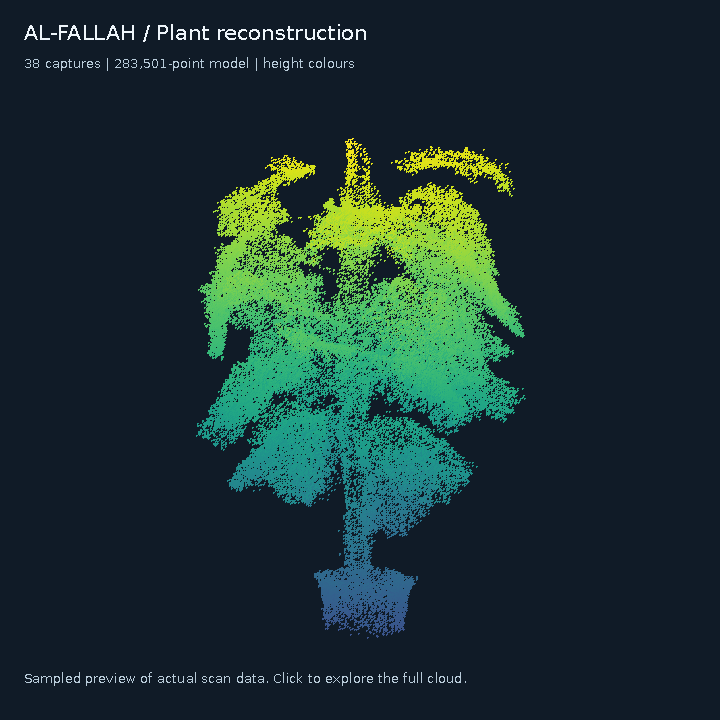
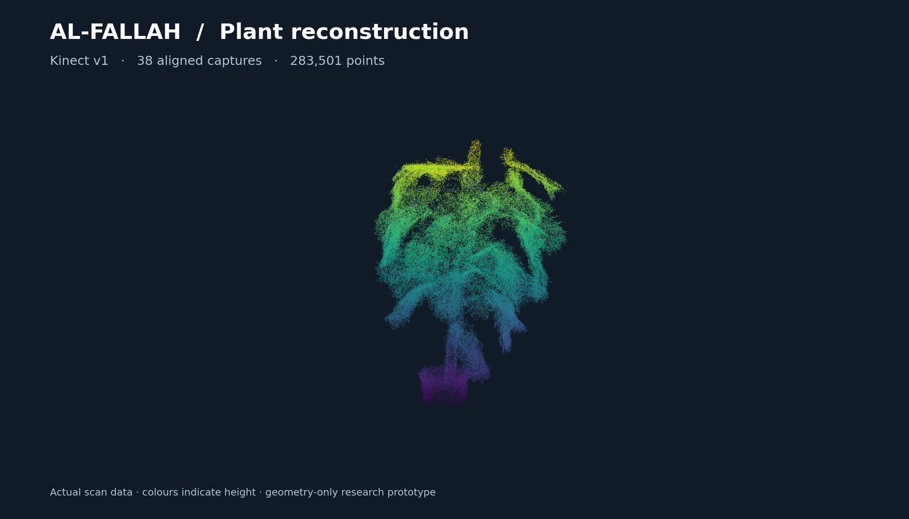
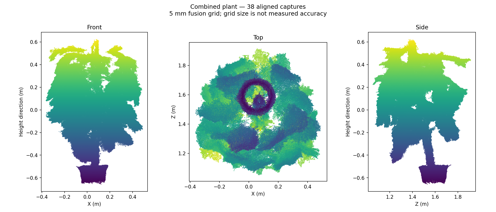

# Kinect v1 plant reconstruction experiment

Manual multi-view capture and offline plant reconstruction using an Xbox 360
Kinect, Ubuntu 22.04 and ROS 2 Humble. This is a perception experiment, not a
validated cutting model or the final AL-FALLAH robot implementation.

This experiment is part of [AL-FALLAH](https://github.com/MahmoudBasio/AL-FALLAH),
a tree-care robotics research project developed by [Mahmoud Basiony](https://www.linkedin.com/in/basio/).
See the [project profile on GitHub](https://github.com/MahmoudBasio) or visit the
[interactive plant point-cloud viewer](https://mahmoudbasio.github.io/AL-FALLAH/).

[](https://MahmoudBasio.github.io/AL-FALLAH/)

Click the animation or photo to open the [live interactive viewer](https://MahmoudBasio.github.io/AL-FALLAH/).

[](https://MahmoudBasio.github.io/AL-FALLAH/)



These images render the saved scan points; colours represent height, not RGB.

### Interactive point cloud

[Download/open the interactive viewer](results/scan_38/interactive_plant.html).
On GitHub, use **Download raw file**, then open the HTML locally. Alternatively,
after cloning, open that file directly in a WebGL-capable browser. GitHub's file
page shows source rather than running HTML. The viewer embeds all 283,501 points,
needs no server or external libraries, and supports rotation, zoom, pan, point
size, preset views and auto-rotation. The embedded coordinates use 16-bit
quantization with less than 0.02 mm added coordinate error on this model; this
does not change the scan's underlying accuracy limitations.

Regenerate it with `python3 build_interactive_viewer.py` (NumPy required).
Regenerate the static 3D image with `python3 render_preview.py` (Matplotlib required).
Regenerate the looping GIF with `python3 render_rotation.py` (NumPy, Matplotlib and Pillow required).
The GIF uses a 65,000-point display sample; the interactive viewer contains the full model.

## What works in this snapshot

- Enter-triggered capture with a two-second settling delay and ten fresh frames.
- Per-pixel temporal median, separate PLY/NPZ saves, and latest-view RViz preview.
- Offline alignment of the recorded 38-view dataset with trimmed multiscale ICP,
  jointly optimized camera poses, and connections between the start and end.
- Plant/floor cropping, 5 mm voxel averaging and a combined 283,501-point PLY.
- A ROS publisher to view the complete saved cloud in RViz.

The manual capture program does **not** fuse new views online. The offline
replay is specific to this dataset: count, crop bounds and candidate pairs are
fixed. It is not a general automatic reconstruction service. The earlier
continuous-fusion prototype is retained under `legacy/`; it suffered drift and
duplicated foliage and is not the recommended capture path.

## Capture on the Kinect laptop

An external Kinect driver must publish organized `sensor_msgs/PointCloud2` on
`/points` in metres. The tested driver workspace was `~/kinect_ws`, with
`ros2 run kinect_ros2 kinect_ros2_node`. Driver source and calibration are not
vendored here. Use the same ROS environment in driver, capture and RViz terminals:

```bash
source /opt/ros/humble/setup.bash
source ~/kinect_ws/install/setup.bash
export ROS_DOMAIN_ID=13
export ROS_LOCALHOST_ONLY=1
export RMW_IMPLEMENTATION=rmw_cyclonedds_cpp
```

From this experiment directory:

```bash
python3 plant_capture_manual.py --settle 2 --frames 10
```

Press Enter, hold still until `SAVED`, then reposition. There is unlimited time
between triggers. Type `q` and Enter to finish. Keep the plant still and maintain
overlap; approximate angle increments are not known camera poses. Each PLY is
in its own camera coordinates and cannot simply be concatenated into a model.
Raw NPZ bursts and `session.json` are saved in the printed `~/plant_views_...` folder.

For the latest capture, RViz Fixed Frame is `kinect_depth` (or the printed input
frame), PointCloud2 topic is `/plant_capture/latest`, and Decay Time is 0.
The preview replaces the previous view after each save. It is not a combined map.

## View the completed 38-view result

After sourcing the ROS environment above, run from this directory:

```bash
python3 view_plant_model.py results/scan_38/plant_combined_38.ply
```

Run `rviz2` in another terminal with matching ROS settings. Set Fixed Frame to
`plant_map`, add PointCloud2 topic `/plant_offline/model`, set Decay Time to 0,
and disable previous point-cloud displays. A starting point size is 0.003 m.
Keep the publisher running; no Kinect is needed to view this saved result.
The export has XYZ only, in metres, with camera-relative forward/left/up axes.
Preview colours indicate height and are not measured RGB.

## Reproduce the recorded experiment

The raw room captures are not committed. With the original `plant_captures_38.zip`
(38 ordered `view_*.ply` files and `session.json`), use a clean checkout:

```bash
python3 -m venv .venv-offline
.venv-offline/bin/pip install -r requirements-offline.txt
.venv-offline/bin/python offline/prepare_captures.py /path/to/plant_captures_38.zip
OMP_NUM_THREADS=1 OPENBLAS_NUM_THREADS=1 .venv-offline/bin/python offline/register_views.py
OMP_NUM_THREADS=1 OPENBLAS_NUM_THREADS=1 .venv-offline/bin/python offline/export_model.py
```

Generated output goes under `offline/`, without replacing the committed result.
The registration caches pair fits in `edges.json` for continuation. Do not reuse
that cache with different inputs. Inspect the printed `WEAK NEIGHBORS` list and
the projections: a fit finishing is not proof that every alignment is correct.
Any weak neighbor requires investigation before using the merged output.

## Results and limits

All 38 captures contributed to the published cloud. Neighboring-view median
nearest-surface distances were about 1.4–9.1 mm, with a median across pairs of
about 6 mm. Optimizing poses reduced the final/first-view median mismatch from
about 11 mm to 5 mm. These are fit scores, not independently measured accuracy.

The floor and distant background were cropped; the pot remains. Voxels need
support from two captures, which can include repeated camera positions.
The lowest 25 mm near the floor is excluded. Thin surfaces can be lost, and leaf
thickness, occlusion gaps and local misalignment remain possible. There is no
semantic plant detector, RGB fusion, missing-surface completion or calibrated
accuracy claim. A 5 mm processing grid does not imply 5 mm sensor accuracy.

See [result notes](results/scan_38/README.md) and
[pose/alignment report](results/scan_38/alignment_report.json).

## Validation

```bash
python3 -m unittest discover -s tests -v
```

Tests exercise padded/endian PointCloud2 decoding, fresh-frame selection,
duplicate timestamps, timeouts, median filtering, saving and preview encoding.
The published PLY was read back and checked against the computed points; its
front/top/side projections were inspected. Live ROS publisher operation is not
tested in CI. Offline processing used Python 3.12, NumPy 2.3.5 and SciPy 1.17.0;
the capture laptop uses Python 3.10 with ROS 2 Humble.

External dependencies: ROS 2/rclpy/sensor_msgs, NumPy, SciPy and Matplotlib.
The legacy prototype additionally uses Open3D 0.19.0 and std_srvs.
Microsoft Kinect and third-party libraries remain the work of their respective
authors. See the [Open3D multiway-registration tutorial](https://www.open3d.org/docs/release/tutorial/pipelines/multiway_registration.html)
for the pose-graph approach; the published offline scripts use NumPy/SciPy.
